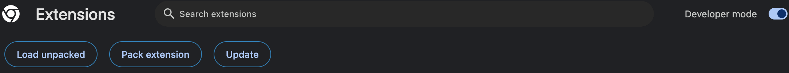

## TextWrap 

A quick little extension to bring some code editor functionalities to chrome. 

Sick of typing closing brackets or quotes like a bum?
Fear not this extension allows you to highlight the required text and wrap it just like your favorite code compilers!

| Currently available wrap:|
|------|
| {}   |
| ()   |
| "    |
| '    |
| `    |
| <    |
| «    |
| „    |
| “    |
| ‘    |
| |    |

 

###  Can't wait to get started? Fork this project over and deploy it yourself!
## Deploy Extension yourself
This extension is currently up for review to be published, however if you would like to deploy it locally and use the extension clone this repo and follow these steps:

1) top right extensions logo: 

    

2) left click and select Manage Extensions:
    
    
3) select developer mode 
4) select Load unpacked and add navigate to the aws-tab-sorter/app file 

    

